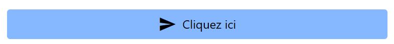

<center><h1>Composant Button</h1></center>

- [Introduction](#introduction)
- [Utilisation](#utilisation)
  - [Avec Twig](#avec-twig)
    - [Syntaxe](#syntaxe)
    - [Arguments](#arguments)
    - [Exemple](#exemple)

# Introduction

Le composant `Button` permet de créer un bouton en spécifiant son contenu et ses propriétés.

# Utilisation

## Avec Twig

### Syntaxe

```twig

```

### Arguments

-   `__id` : Identifiant du bouton
-   `__text` : Texte du bouton
-   `__type` : Type du bouton (default, submit, reset)
-   `__icon` : Nom de l'icône à afficher (synonyme de `__iconBefore`)
-   `__iconBefore` : Nom de l'icône à afficher avant le texte (prioritaire sur `__icon`)
-   `__iconAfter` : Nom de l'icône à afficher après le texte

### Exemple

```twig

```

