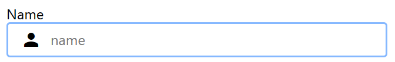

<center><h1>Fonction createComponent</h1></center>

- [Introduction](#introduction)
- [Initialisation](#initialisation)
- [Utilisation](#utilisation)
     - [Syntaxe](#syntaxe)
     - [Paramètres](#paramètres)
     - [Valeur de retour](#valeur-de-retour)
     - [Exemple](#exemple)

# Introduction

La fonction `createComponent` permet de créer un composant en spécifiant son nom, ses propriétés et ses méthodes.

# Initialisation

Pour pouvoir utiliser la fonction `createComponent`, il suffit d'ajouter le code suivant dans un fichier Twig :

```twig

```

Par défaut, l'importation est faite dans le fichier `base.twig`.

# Utilisation

## Syntaxe

```typescript
function createComponent(
    name: string,
    args: {
        [key: string]: any;
    },
    data: {
        [key: string]: any;
    }
): {
    components: [{}];
    data: {};
    element: HTMLElement;
};
```

## Paramètres

- `name` : Le nom du composant à créer.
- `args` : Les propriétés du composant.
- `data` : Les données utilisées par le composant.

## Valeur de retour

La fonction renvoie un objet contenant les propriétés `components`, `data` et `element`.

- `components` : La liste des composants du même type.
- `data` : Les données utilisées par le composant.
- `element` : L'élément HTML du composant.

## Exemple

```typescript
const component = app.createComponent('textarea', {
    id: 'name',
    name: 'name',
    label: 'Name',
    icon: 'person',
    placeholder: 'name',
    value: 'John Doe'
});

document.body.append(component.element);

console.log(component.data.value); // John Doe
```


