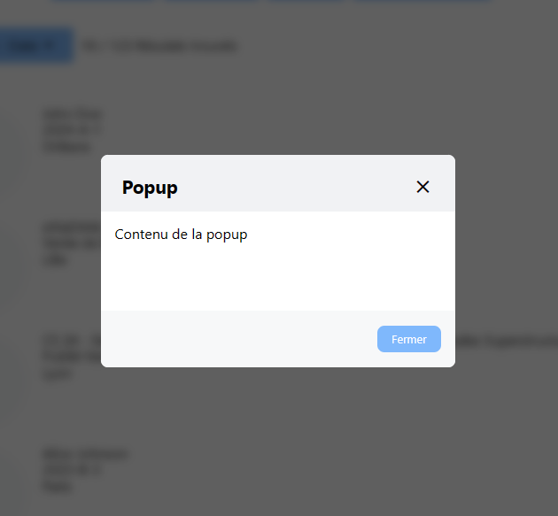
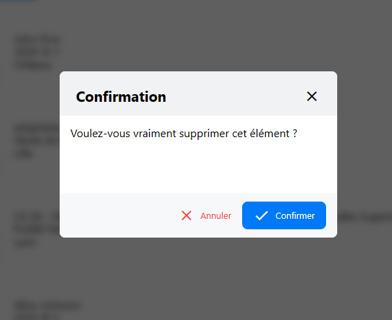

<center><h1>Les popups</h1></center>

- [Introduction](#introduction)
- [Initialisation](#initialisation)
- [Utilisation](#utilisation)
  - [Créer une popup](#créer-une-popup)
    - [Syntaxe](#syntaxe)
    - [Paramètres](#paramètres)
    - [Valeur de retour](#valeur-de-retour)
    - [Exemple](#exemple)
  - [Créer une popup de confirmation](#créer-une-popup-de-confirmation)
    - [Syntaxe](#syntaxe-1)
    - [Paramètres](#paramètres-1)
    - [Valeur de retour](#valeur-de-retour-1)
    - [Exemple](#exemple-1)

# Introduction

Les popups sont des fenêtres qui s'affichent au dessus de la page web. Elles sont souvent utilisées pour afficher des messages d'erreur, des informations supplémentaires ou des formulaires. Les popups sont généralement plus petites que la fenêtre principale et peuvent fermées par l'utilisateur.

# Initialisation

Pour pouvoir utiliser une popup dans une page, il faut que le code Javascript correspondant soit chargé. Pour cela, il suffit d'ajouter la ligne suivante dans le fichier Twig :

```twig

```

Par défault, l'importation est faite dans le fichier `base.twig`.

> **Note** : Le fichier `plugins/dialog.js` dépend du fichier `core/app.js`.
>
> Exemple :
>
> ```twig
> 
> ```

# Utilisation

## Créer une popup

Pour créer une popup, il suffit d'appeler la fonction `app.dialog.create()` en lui passant un objet de configuration.

### Syntaxe

```typescript
app.dialog.create({
    title: string | undefined,
    content: string | HTMLElement | Array<HTMLElement | string> | undefined,
    buttons: Array<{
        text: string,
        icon: string | undefined,
        color: string | undefined,
        filled: boolean | undefined,
        action: ((close: () => HTMLDivElement) => void) | 'close' ,
    }> | undefined,
    parseHTML: boolean | undefined,
    onClose: (() => void) | undefined,
}): {
    element: HTMLDivElement,
    close: () => HTMLDivElement,
    show: () => HTMLDivElement,
}
```

### Paramètres

-   `title` : Le titre de la popup.
-   `content` : Le contenu de la popup. Peut être une chaîne de caractères, un élément HTML ou un tableau d'éléments HTML et de chaînes de caractères.
-   `buttons` : Les boutons de la popup. Chaque bouton est un objet avec les propriétés suivantes :
    -   `text` : Le texte du bouton.
    -   `icon` : L'icône du bouton.
    -   `color` : La couleur du bouton.
    -   `filled` : Indique si le bouton est rempli.
    -   `action` : La fonction à exécuter lorsque le bouton est cliqué. Si la valeur est `'close'`, la popup sera fermée.
-   `parseHTML` : Indique si le contenu de la popup doit être interprété comme du HTML.
-   `onClose` : La fonction à exécuter lorsque la popup est fermée.

### Valeur de retour

-   `element` : L'élément HTML de la popup.
-   `close` : La fonction pour fermer la popup.
-   `show` : La fonction pour afficher la popup.

### Exemple

```typescript
const popup = app.dialog
	.create({
		title: 'Popup',
		content: 'Contenu de la popup',
		buttons: [
			{
				text: 'Fermer',
				action: 'close',
				filled: true,
				color: '#85b8ff'
			}
		],
		parseHTML: false,
		onClose: () => {
			console.log('Popup fermée');
		}
	})
	.show();
```



Pour fermer la popup, il suffit d'appeler la fonction `close()` retournée par `app.dialog.create()`.

Exemple:

```typescript
popup.close();
```

## Créer une popup de confirmation

Pour créer une popup de confirmation, il suffit d'appeler la fonction `app.dialog.confirm()` en lui passant un objet de configuration.

### Syntaxe

```typescript
app.dialog.confirm({
    title: string | undefined,
    content: string | HTMLElement | Array<HTMLElement | string> | undefined,
    parseHTML: boolean | undefined,
    onConfirm: () => void,
    onReject: () => void,
}): {
    element: HTMLDivElement,
    close: () => HTMLDivElement,
    show: () => HTMLDivElement,
    onConfirm: () => void,
    onReject: () => void,
    toPromise: () => Promise<boolean>,
}
```

### Paramètres

-   `title` : Le titre de la popup.
-   `content` : Le contenu de la popup. Peut être une chaîne de caractères, un élément HTML ou un tableau d'éléments HTML et de chaînes de caractères.
-   `parseHTML` : Indique si le contenu de la popup doit être interprété comme du HTML.
-   `onConfirm` : La fonction à exécuter lorsque l'utilisateur confirme.
-   `onReject` : La fonction à exécuter lorsque l'utilisateur rejette.

### Valeur de retour

-   `element` : L'élément HTML de la popup.
-   `close` : La fonction pour fermer la popup.
-   `show` : La fonction pour afficher la popup.
-   `onConfirm` : La fonction à exécuter lorsque l'utilisateur confirme.
-   `onReject` : La fonction à exécuter lorsque l'utilisateur rejette.
-   `toPromise` : Retourne une promesse qui est résolue lorsque l'utilisateur confirme et rejetée lorsqu'il rejette.

### Exemple

```typescript
const popup = app.dialog
	.confirm({
		title: 'Confirmation',
		content: 'Voulez-vous vraiment supprimer cet élément ?',
		parseHTML: false,
		onConfirm: () => {
			console.log('Suppression confirmée');
		},
		onReject: () => {
			console.log('Suppression annulée');
		}
	})
	.show();
```



Pour obtenir le résultat de la confirmation, il suffit d'appeler la fonction `toPromise()` retournée par `app.dialog.confirm()`.

Exemple:

```typescript
popup.toPromise().then((confirmed) => {
	if (confirmed) {
		console.log('Suppression confirmée');
	} else {
		console.log('Suppression annulée');
	}
});
```
