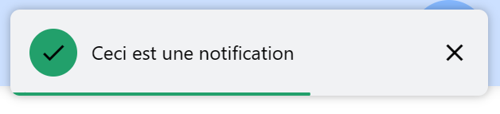
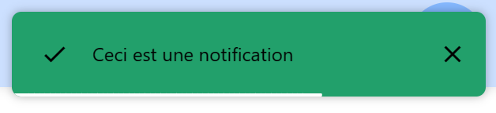
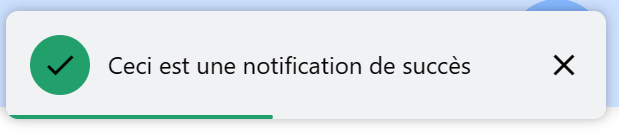
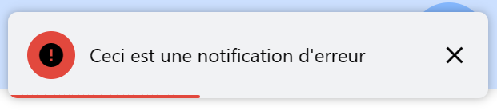
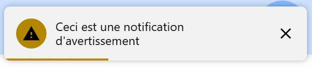
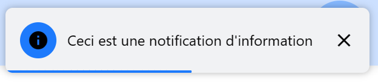

<center><h1>Les notifications</h1></center>

- [Introduction](#introduction)
- [Initialisation](#initialisation)
- [Utilisation](#utilisation)
     - [Afficher une notification](#afficher-une-notification)
          - [Syntaxe](#syntaxe)
          - [Paramètres](#paramètres)
          - [Valeur de retour](#valeur-de-retour)
          - [Exemples](#exemples)
     - [Raccourcis pour afficher une notification d'un type spécifique](#raccourcis-pour-afficher-une-notification-dun-type-spécifique)
          - [Exemples](#exemples-1)

# Introduction

Les notifications sont des messages qui s'affichent en haut de la page web. Elles sont souvent utilisées pour afficher des messages d'erreur, des informations supplémentaires ou des alertes. Les notifications sont généralement plus petites que la fenêtre principale et peuvent être fermées par l'utilisateur.

# Initialisation

Pour pouvoir utiliser les notifications dans une page, il faut que le code Javascript correspondant soit chargé. Pour cela, il suffit d'ajouter la ligne suivante dans le fichier Twig :

```twig

```

Par défaut, l'importation est faite dans le fichier `base.twig`.

> **Note** : Le fichier `plugins/toast.js` dépend du fichier `core/app.js`.
> 
> Exemple :
> 
> ```twig
> 
> ```

# Utilisation

## Afficher une notification

Pour afficher une notification, il suffit d'appeler la fonction `app.toast.create()` en lui passant un objet de configuration.

### Syntaxe

```typescript
app.toast.create(
    message: string,
    options: {
        type?: 'success' | 'error' | 'warning' | 'info',
        duration?: number,
        parseHTML?: boolean,
        filled: boolean,
    }
): {
    close: () => void,
    pause: () => void,
    resume: () => void,
    element: HTMLDivElement,
}
```

### Paramètres

- `message` : Le message à afficher. Peut être du texte ou de l'HTML.
- `options` : Les options de la notification. Les options possibles sont les suivantes :
     - `type` : Le type de la notification. Peut être `'success'`, `'error'`, `'warning'` ou `'info'`.
     - `duration` : La durée d'affichage de la notification en millisecondes. Par défaut, la notification reste affichée 5 secondes.
     - `parseHTML` : Indique si le message est du code HTML.
     - `filled` : Indique si la notification est remplie.

### Valeur de retour

- `close` : Une fonction qui permet de fermer la notification.
- `pause` : Une fonction qui permet de mettre en pause la notification.
- `resume` : Une fonction qui permet de reprendre l'affichage de la notification.
- `element` : L'élément HTML de la notification.

### Exemples

```typescript
app.toast.create('Ceci est une notification', {
    type: 'success',
    duration: 3000,
    parseHTML: false,
    filled: false
});
```



```typescript
app.toast.create('<b>Ceci est une notification</b>', {
    type: 'error',
    duration: 5000,
    parseHTML: true,
    filled: true
});
```



Pour fermer une notification, il suffit d'appeler la fonction `close()` retournée par `app.toast.create()`.

```typescript
const toast = app.toast.create('Ceci est une notification', {
    type: 'warning',
    duration: 5000,
    parseHTML: false,
    filled: false
});
toast.close();
```

Il est aussi possible de mettre en pause et de reprendre l'affichage de la notification.

```typescript
const toast = app.toast.create('Ceci est une notification', {
    type: 'info',
    duration: 5000,
    parseHTML: false,
    filled: false
});
toast.pause();
// La notification est en pause
toast.resume();
```

## Raccourcis pour afficher une notification d'un type spécifique

Il existe des fonctions raccourcies pour afficher une notification d'un type spécifique. Ces fonctions sont les suivantes :

- `app.toast.success(message, options?)` : Affiche une notification de succès.
- `app.toast.error(message, options?)` : Affiche une notification d'erreur.
- `app.toast.warning(message, options?)` : Affiche une notification d'avertissement.
- `app.toast.info(message, options?)` : Affiche une notification d'information.

### Exemples

```typescript
app.toast.success('Ceci est une notification de succès');
```



```typescript
app.toast.error("Ceci est une notification d'erreur");
```



```typescript
app.toast.warning("Ceci est une notification d'avertissement");
```



```typescript
app.toast.info("Ceci est une notification d'information");
```


