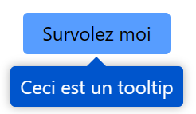
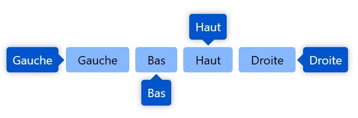

<center><h1>Les tooltip</h1></center>

- [Introduction](#introduction)
- [Initialisation](#initialisation)
- [Utilisation](#utilisation)
     - [Afficher un tooltip grâce à l'attribut `c-tooltip`](#afficher-un-tooltip-grâce-à-lattribut-c-tooltip)
          - [Exemple](#exemple)
     - [Afficher un tooltip grâce à la fonction `app.tooltip.show()`](#afficher-un-tooltip-grâce-à-la-fonction-apptooltipshow)
          - [Syntaxe](#syntaxe)
          - [Paramètres](#paramètres)
          - [Valeur de retour](#valeur-de-retour)
          - [Exemple](#exemple-1)

# Introduction

Les tooltips sont des messages qui s'affichent au survol d'un élément. Ils sont souvent utilisés pour afficher des informations supplémentaires ou des explications sur un élément. Les tooltips sont généralement plus petits que la fenêtre principale et disparaissent automatiquement après un certain temps.

# Initialisation

Pour pouvoir utiliser les tooltips dans une page, il faut que le code Javascript correspondant soit chargé. Pour cela, il suffit d'ajouter la ligne suivante dans le fichier Twig :

```twig

```

Par défaut, l'importation est faite dans le fichier `base.twig`.

> **Note** : Le fichier `plugins/tooltip.js` dépend du fichier `core/app.js`.
> 
> Exemple :
> 
> ```twig
> 
> ```

# Utilisation

## Afficher un tooltip grâce à l'attribut `c-tooltip`

Pour afficher un tooltip, il suffit d'ajouter l'attribut `c-tooltip` à l'élément sur lequel on veut afficher le tooltip. Le contenu du tooltip est défini dans l'attribut `c-tooltip`.

### Exemple

```html
<button c-tooltip="Ceci est un tooltip">Survolez-moi</button>
```



Il est possible de personnaliser le comportement du tooltip en ajoutant des attributs supplémentaires :

- `c-tooltip-position` : Permet de définir la position du tooltip par rapport à l'élément. Les valeurs possibles sont `top`, `bottom`, `left` et `right`.
- `c-tooltip-delay` : Permet de définir le délai avant l'affichage du tooltip en millisecondes.
- `c-tooltip-align` : Permet de définir l'alignement du tooltip par rapport à l'élément. Les valeurs possibles sont `border` et `center`.
- `c-tooltip-offset` : Permet de définir un décalage du tooltip par rapport à l'élément. La valeur doit être un nombre de pixels.

## Afficher un tooltip grâce à la fonction `app.tooltip.show()`

### Syntaxe

```typescript
app.tooltip.show({
    target: HTMLElement | string,
    content: string | HTMLElement,
    options: {
        position: 'top' | 'bottom' | 'left' | 'right',
        delay: number,
        offset: number,
        align: 'border' | 'center',
        parseHTML: boolean,
        styled: boolean,
        appendTo: HTMLElement,
        fullWidth: boolean,
    }
}): {
    element: HTMLDivElement,
    content: string | HTMLElement,
    id: number,
    parseHTML: boolean,
    position: 'top' | 'bottom' | 'left' | 'right',
    target: HTMLElement,
    offset: number,
    styled: boolean,
    appendTo: HTMLElement,
    align: 'border' | 'center',
    fullWidth: boolean,
    remove: () => void,
    hide: () => void,
}
```

### Paramètres

- `target` : L'élément sur lequel afficher le tooltip.
- `content` : Le contenu du tooltip.
- `options` : Les options de configuration du tooltip.
     - `position` : La position du tooltip par rapport à l'élément.
     - `delay` : Le délai avant l'affichage du tooltip en millisecondes.
     - `offset` : Le décalage du tooltip par rapport à l'élément.
     - `align` : L'alignement du tooltip par rapport à l'élément.
     - `parseHTML` : Indique si le contenu du tooltip doit être interprété comme du HTML.
     - `styled` : Indique si le tooltip doit être stylisé.
     - `appendTo` : L'élément dans lequel ajouter le tooltip.
     - `fullWidth` : Indique si le tooltip doit avoir la largeur de l'élément cible.

### Valeur de retour

La valeur de retour est un Proxy qui contient les propriétés suivantes :

- `element` : L'élément HTML du tooltip.
- `content` : Le contenu du tooltip.
- `id` : L'identifiant du tooltip.
- `parseHTML` : Indique si le contenu du tooltip doit être interprété comme du HTML.
- `position` : La position du tooltip par rapport à l'élément.
- `target` : L'élément sur lequel afficher le tooltip.
- `offset` : Le décalage du tooltip par rapport à l'élément.
- `styled` : Indique si le tooltip est stylisé.
- `appendTo` : L'élément dans lequel le tooltip est ajouté.
- `align` : L'alignement du tooltip par rapport à l'élément.
- `fullWidth` : Indique si le tooltip a la largeur de l'élément cible.
- `remove` : La fonction pour supprimer le tooltip. Identique à `hide`.
- `hide` : La fonction pour supprimer le tooltip. Identique à `remove`.

> Le Proxy permet de modifier les différentes propriétés du tooltip.
> Les modifications apportées au Proxy sont répercutées sur le tooltip.

### Exemple

```typescript
app.tooltip.show(leftElement, 'Gauche', {position: 'left'});
app.tooltip.show(bottomElement, 'Bas', {position: 'bottom'});
app.tooltip.show(topElement, 'Haut', {position: 'top'});
app.tooltip.show(rightElement, 'Droite', {position: 'right'});
```

